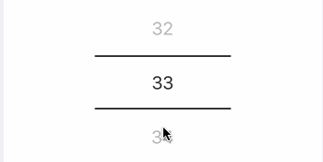

## react-native-wheely-good-picker

### changes in fork
* ensured scroll on footer is forbidden (no more scrolling under list)
* applied some Airbnb eslint rules

a pure js picker, each option item customizable




### usage

`npm i react-native-wheely-simple-picker`

```jsx
import React, {Component} from 'react';
import ScrollPicker from 'react-native-wheely-good-picker';

export default class SimpleExample extends Component {

    render() {
        return(
             <ScrollPicker
                  dataSource={[
                       'a',
                       'b',
                       'c',
                       'd',
                  ]}
                  selectedIndex={1}
                  renderItem={(data, index, isSelected) => {
                      //
                  }}
                  onValueChange={(data, selectedIndex) => {
                      //
                  }}
                  wrapperHeight={180}
                  wrapperWidth={150}
                  wrapperBackground="#FFFFFF"
                  itemHeight={60}
                  highlightColor="#d8d8d8"
                  highlightBorderWidth={2}
                  activeItemColor="#222121"
                  itemColor="#222121"
                />
        )
    }
}
```
